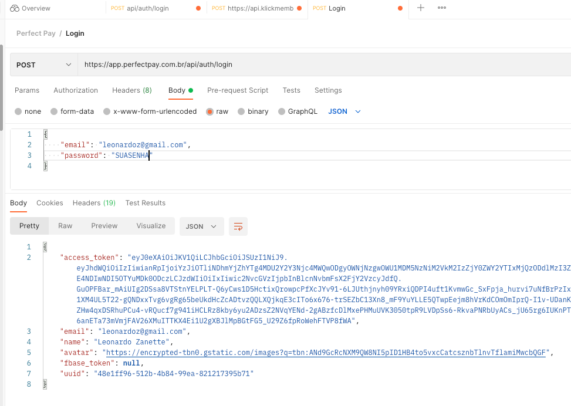
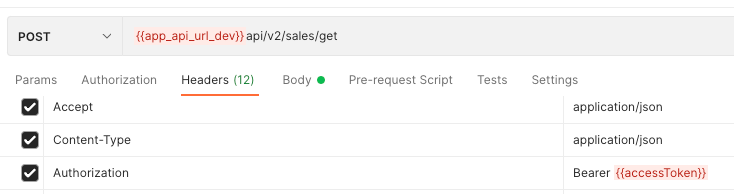

Crie a Classe abaixo, que tem os métodos para buscar na API

Altere os campos SEUEMAIL e SUASENHA

```php
<?php

namespace App\Api;

class PerfectPayApi
{
    private string $email;
    private string $password;
    private string $requestUrl;
    private string $apiUrl;
    private string $accessToken;

    public function __construct()
    {
        $this->email    = 'SEUEMAIL';
        $this->password = 'SUASENHA';
        $this->apiUrl   = 'https://app.perfectpay.com.br/api';
    }

    public function request(array $data, array $headers = [])
    {
        $headers += [
            'Content-type: application/json',
            'Accept: application/json'
        ];

        $ch = curl_init();
        curl_setopt($ch, CURLOPT_URL, $this->apiUrl . $this->requestUrl);
        curl_setopt($ch, CURLOPT_RETURNTRANSFER, true);
        curl_setopt($ch, CURLOPT_POST, true);
        curl_setopt($ch, CURLOPT_POSTFIELDS, json_encode($data));
        curl_setopt($ch, CURLOPT_HTTPHEADER, $headers);

        $response = curl_exec($ch);
        $result   = json_decode($response, true);
        curl_close($ch);

        return $result;
    }

    public function getAccessToken()
    {
        $this->requestUrl = '/auth/login';
        $data             = [
            'email'    => $this->email,
            'password' => $this->password,
        ];

        $result = $this->request($data);

        // retorno esperado se quiser depurar pode descomentar
        // echo "Access Token: " . $result['access_token'] . "\n";
        // echo "Email: " . $result['email'] . "\n";
        // echo "Name: " . $result['name'] . "\n";
        // echo "Avatar: " . $result['avatar'] . "\n";

        if (empty($result['access_token'])) {
            throw new \Exception('ERRO');
        }

        return $result['access_token'];
    }

    public function getSales(string $accessToken, array $filters)
    {
        $headers          = [
            "Authorization: Bearer $accessToken",
        ];
        $this->requestUrl = '/v2/sales/get';

        return $this->request($filters, $headers);
    }

    public function getSubscriptions(string $accessToken, array $filters)
    {
        $headers          = [
            "Authorization: Bearer $accessToken",
        ];
        $this->requestUrl = '/v2/subscriptions/get';

        return $this->request($filters, $headers);
    }
}

```

Depois disso pode fazer suas requisições:

### Pegar Access Token

```php
use App\Api\test\PerfectPayApi;
    // ... 
    $perfectPayApi = (new PerfectPayApi());
    $accessToken = $perfectPayApi->getAccessToken();
    // salve esse access token para não precisa ficar toda hora gerando
```

### Pegar Assinaturas

```php
use App\Api\test\PerfectPayApi;
    // ... 
    $perfectPayApi = (new PerfectPayApi());
    $accessToken = $perfectPayApi->getAccessToken();
    // salva esse access token para não precisa ficar toda hora gerando

    // agora pode requisitar os dados das assinaturas
    $filters  = [
        'customer_email'   => 'emaildocliente@gmail.com',
        // 'identification_number' => 12312312312" // filtro por cpf
    ];
    $getSubscriptions = $perfectPayApi->getSubscriptions($accessToken, $filters);
    // retorno exemplo pode ser encontrado aqui https://support.perfectpay.com.br/doc/perfectpay/perfectpay-api/assinatura

    // data terão todas as assinaturas encontradas
    if (empty($getSubscriptions['data'])) {
        echo "Nenhuma assinatura encontrada!";
        // tratar assinatura não encotrada
    }
    $getSubscriptionsResults = $getSubscriptions['data'];
    foreach ($getSubscriptionsResults as $getSubscriptionsResult) {
        // trata todas as assinatuas encontradas para o filtro escolhido
        if ($getSubscriptionsResult['subscription_status_enum'] == "Ativa") {
            // trata assinatura ativa
        } elseif ($getSubscriptionsResult['subscription_status_enum'] == "Aguardando pagamento") {
            // trata assinatura pendente
        } elseif ($getSubscriptionsResult['subscription_status_enum'] == "Cancelada") {
            // trata assinatura que cliente não pagou
        }
    }


    dump($getSubscriptions);
```

--- 
--- 

### Exemplo funcionamento no Postman

Logando com seu email na url:

POST https://app.perfectpay.com.br/api/auth/login

Você recebe o access_token

» Com esse valor você deve colocar no header das outras requisições, esse será seu login ao sistema



#### Colocando no header a informação



### 

## Com o api token

```php
<?php

namespace App\Api;

class PerfectPayApi
{
    private string $email;
    private string $password;
    private string $requestUrl;
    private string $apiUrl;
    private string $accessToken;

    public function __construct()
    {
        $this->apiToken    = 'TOKEN DENTRO DA PAY EM FERRAMENTAS > API';
        $this->apiUrl   = 'https://app.perfectpay.com.br/api';
    }

    public function request(array $data, array $headers = [])
    {
        $headers += [
            'Content-type: application/json',
            'Accept: application/json'
        ];

        $ch = curl_init();
        curl_setopt($ch, CURLOPT_URL, $this->apiUrl . $this->requestUrl);
        curl_setopt($ch, CURLOPT_RETURNTRANSFER, true);
        curl_setopt($ch, CURLOPT_POST, true);
        curl_setopt($ch, CURLOPT_POSTFIELDS, json_encode($data));
        curl_setopt($ch, CURLOPT_HTTPHEADER, $headers);

        $response = curl_exec($ch);
        $result   = json_decode($response, true);
        curl_close($ch);

        return $result;
    }

    public function getSales(array $filters)
    {
        $headers          = [
            "Authorization: Bearer $this->apiToken",
        ];
        $this->requestUrl = '/v2/sales/get';

        return $this->request($filters, $headers);
    }

    public function getSubscriptions(array $filters)
    {
        $headers          = [
            "Authorization: Bearer $this->apiToken",
        ];
        $this->requestUrl = '/v2/subscriptions/get';

        return $this->request($filters, $headers);
    }
}
// Filtros
// 'page'                => 'nullable|integer|min:1|max:10000',
// 'paginate'            => 'nullable|integer|min:1|max:1000',
// "start_date_approved" => "required_without_all:start_date_sale,start_date_updated,transaction_token|date_format:Y-m-d",
// "end_date_approved"   => "required_with:start_date_approved|date_format:Y-m-d",
// "start_date_sale"     => "required_without_all:start_date_approved,start_date_updated,transaction_token|date_format:Y-m-d",
// "end_date_sale"       => "required_with:start_date_sale|date_format:Y-m-d",
// "start_date_updated"  => "required_without_all:start_date_approved,start_date_sale,transaction_token|date_format:Y-m-d",
// "end_date_updated"    => "required_with:start_date_updated|date_format:Y-m-d",
// 'sale_status'         => 'nullable|array',
// 'transaction_token'   => 'nullable|string|max:50',
// 'email'               => 'nullable|string|email|max:200',
// 'product_code'               => 'nullable|string|max:300',

$perfectPayApi = new PerfectPayApi();
$sales = $perfectPayApi->getSales(['email' => 'contato@email.com']);
$sales = $perfectPayApi->getSales([
                                    'email' => 'contato@email.com', 
                                    'product_code' => 'PPP1111,PPP2222,PPP3333'
]);

foreach ($sales as $sale) {
    if ($sale['product_code'] == '') {
    
    } 
    // percorre sales
}

```
